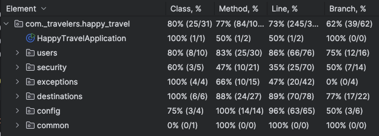
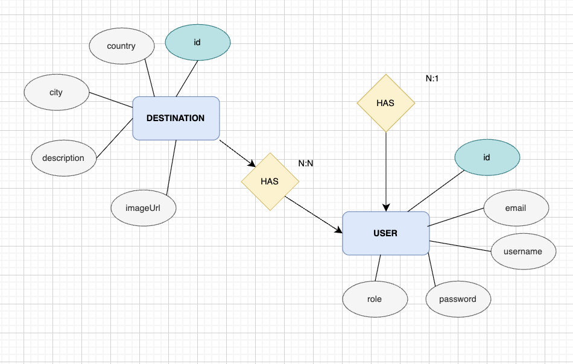
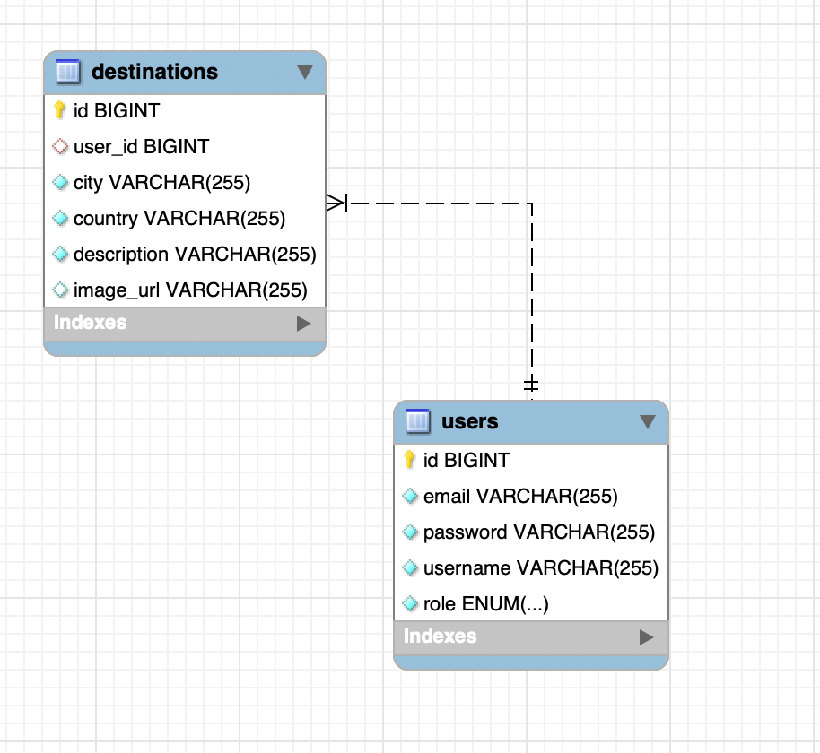

# Happy Travel

**Happy Travel** is a web application designed for travel enthusiasts to create, manage, and explore travel destinations. It offers user registration, destination CRUD operations, filtering, authentication via JWT, and role-based authorization.

##  Features

### User
- Registration & Login (with password validation)
- Admin panel to view and manage users

### Destinations
- Create, Read, Update, Delete (with image URLs)
- Search & Filter Destinations (by city/country/username)

### Security
- **JWT Authentication** and role-based access (USER / ADMIN)

### Documentation 
- **Swagger API Documentation**

### Exception Handling
- The application uses @ControllerAdvice for global exception handling. 
- The custom exceptions EntityNotFoundException and EntityAlreadyExistsException provide clear, domain-specific error messages.
- Ensuring all errors are returned in a consistent and readable JSON format with fields such as timestamp, path and error code.

---

##  Tech Stack

### Backend
- Java 17
- Spring Boot 3
- Spring Security (JWT)
- Hibernate & Spring Data JPA
- MySQL
- Swagger 
- Lombok
- IntelliJ IDEA CE

---

##  Project Structure

```
├── example .env
├── mvnw
├── mvnw.cmd
├── pom.xml
├── src
│   ├── main
│   │   ├── java
│   │   │   └── com
│   │   │       └── _travelers
│   │   │           └── happy_travel
│   │   │               ├── HappyTravelApplication.java
│   │   │               ├── common
│   │   │               ├── config
│   │   │               ├── destinations
│   │   │               ├── exceptions
│   │   │               ├── security
│   │   │               └── users
│   │   └── resources
│   │       └── application.yaml
│   └── test
│       └── java
│           └── com
│               └── _travelers
│                   └── happy_travel
│                       ├── HappyTravelApplicationTests.java
│                       ├── destination
│                       └── users
└── target
    ├── classes
    │   ├── application.yaml
    │   └── com
    │       └── _travelers
    │           └── happy_travel
    │               ├── HappyTravelApplication.class
    │               ├── common
    │               │   └── SecuredBaseController.class
    │               ├── config
    │               │   ├── DataSeeder.class
    │               │   ├── DefaultAdminInitializer.class
    │               │   ├── OpenApiConfig.class
    │               │   └── SecurityConfig.class
    │               ├── destinations
    │               │   ├── Destination.class
    │               │   ├── DestinationController.class
    │               │   ├── DestinationRepository.class
    │               │   ├── DestinationService.class
    │               │   └── dto
    │               ├── exceptions
    │               │   ├── EntityAlreadyExistsException.class
    │               │   ├── EntityNotFoundException.class
    │               │   ├── ErrorResponse.class
    │               │   └── GlobalExceptionHandler.class
    │               ├── security
    │               │   ├── AuthController.class
    │               │   ├── CustomUserDetail.class
    │               │   └── jwt
    │               └── users
    │                   ├── AdminController.class
    │                   ├── Role.class
    │                   ├── User.class
    │                   ├── UserController.class
    │                   ├── UserRepository.class
    │                   ├── UserService.class
    │                   └── dto
    ├── generated-sources
    │   └── annotations
    ├── generated-test-sources
    │   └── test-annotations
    └── test-classes
        └── com
            └── _travelers
                └── happy_travel
                    ├── HappyTravelApplicationTests.class
                    ├── destination
                    │   ├── DestinationControllerTest.class
                    │   └── DestinationServiceTest.class
                    └── users
                        ├── UserControllerTest.class
                        └── UserServiceTest.class

```
---

##  Authentication and Security

- JWT-based authentication and role-based authorization with Spring Security 6 to protect API endpoints.
- A custom JwtAuthFilter intercepts requests, validates tokens, and sets the security context, while SecurityConfig defines public and protected routes, CORS, and stateless session handling.
- Unauthorized or invalid requests return consistent JSON error responses with HTTP 401 status.

All protected endpoints require a valid JWT token. To test with Swagger:

1. Register/login via `/register` or `/login`
2. Copy the JWT token from the login response
3. Click **Authorize** in Swagger and paste `Bearer <your-token>`

---

##  Getting Started

### Backend Setup

```bash
# Clone the repository
git clone https://github.com/404-Travelers/happy-travel
cd happy-travel

# Setup environment variables
cp .env.example .env
# Edit .env with your DB credentials and admin info

# Run the application
./mvnw spring-boot:run
```

### Required .env file

```
DB_URL=jdbc:mysql://localhost:3306/happy-travel?createDatabaseIfNotExist=true
SERVER_PORT=8080
PORT_FRONT=3001  //default port 3000
DB_USER=root
DB_PASSWORD=root

ADMIN_EMAIL=admin12@example.com
ADMIN_USERNAME=admin12
ADMIN_PASSWORD=admin123
```

### Swagger UI

- [http://localhost:8080/swagger-ui/index.html#/](http://localhost:8080/swagger-ui/index.html#/)

### Frontend Setup

```bash
# Go to frontend folder (or clone repo)
cd happy-travel-frontend

# Install dependencies
npm install

# Run dev server
npm run dev
```

---

##  Postman Collection

- Workspace: [Happy Travel Postman](https://travelers404.postman.co/)

---

##  Endpoints Overview  

### Auth
| HTTP Method | Endpoint            | Description                              | Request Body            | Response Status | Response Body / Notes                       | Security      |
| :---------- | :------------------ | :------------------------------------- | :---------------------- | :-------------- | :----------------------------------------- | :------------ |
| `POST`      | `/register`         | Register a new user.                    | User registration JSON  | `201 Created`   | Created user info or error details          | Public       |
| `POST`      | `/login`            | Login and obtain JWT token.             | Login credentials JSON  | `200 OK`        | JWT token and user info                      | Public       |
| `POST`      | `/admin/register`   | Register a new admin user (admin only).| Admin registration JSON | `201 Created`   | Created admin user info or error details    | Admin        |
### Users
| HTTP Method | Endpoint               | Description                            | Request Body           | Response Status | Response Body / Notes                        | Security      |
| :---------- | :--------------------- | :----------------------------------- | :--------------------- | :-------------- | :------------------------------------------ | :------------ |
| `GET`       | `/users/me`            | Get current user profile.             | *None*                 | `200 OK`        | User profile data                           | Authenticated |
| `GET`       | `/users/me/destinations`| Get destinations for current user.   | *None*                 | `200 OK`        | List of user's destinations                 | Authenticated |
| `PUT`       | `/users/me`            | Update current user profile.          | User update JSON       | `200 OK`        | Updated user profile data                   | Owner        |
| `DELETE`    | `/users/me`            | Delete current user account.          | *None*                 | `200 OK`        | Confirmation or status message              | Owner        |
### Destinations
| HTTP Method | Endpoint                | Description                            | Request Body                          | Response Status | Response Body / Notes                                       | Security      |
| :---------- | :---------------------- | :----------------------------------- | :---------------------------------- | :-------------- | :--------------------------------------------------------- | :------------ |
| `GET`       | `/destinations`         | Retrieves all destinations.           | *None*                              | `200 OK`        | List of destination objects                                | Public       |
| `GET`       | `/destinations/auth`    | Retrieves destinations with current user on top.| *None*                   | `200 OK`        | List prioritized with user first                           | Authenticated |
| `GET`       | `/destinations/filter`  | Filters destinations by city and country.| *None*                           | `200 OK`        | List of filtered destinations                              | Public       |
| `GET`       | `/destinations/{id}`    | Retrieves destination by ID.          | *None*                              | `200 OK`        | Destination if found; `404 Not Found` if not               | Public       |
| `GET`       | `/destinations/user`    | Retrieves destinations by username.   | *None*                              | `200 OK`        | List of destinations for specified user                    | Public       |
| `POST`      | `/destinations`         | Creates a new destination.             | Destination JSON (e.g., `DestinationRequest`) | `201 Created` | Created object; `400 Bad Request` for invalid input         | Authenticated |
| `PUT`       | `/destinations/{id}`    | Updates a destination by ID.            | Destination JSON                    | `200 OK`        | Updated destination; errors for invalid input or not found | Authenticated |
| `DELETE`    | `/destinations/{id}`    | Deletes destination by ID.             | *None*                              | `200 OK`        | Deleted destination; `404 Not Found` if not found          | Authenticated |
### Admin
| HTTP Method | Endpoint                | Description                          | Request Body          | Response Status | Response Body / Notes                       | Security      |
| :---------- | :---------------------- | :--------------------------------- | :-------------------- | :-------------- | :----------------------------------------- | :------------ |
| `GET`       | `/admin/users`          | List all users (admin only).       | *None*                | `200 OK`        | List of users                              | Admin        |
| `GET`       | `/admin/users/{id}`     | Get a user by ID (admin only).     | *None*                | `200 OK`        | User info or `404 Not Found` if not found  | Admin        |
| `DELETE`    | `/admin/users/{id}`     | Delete a user by ID (admin only)   | *None*                | `200 OK`        | Confirmation or `404 Not Found` if absent  | Admin        |

- Public (no authentication required)
- Authenticated (user must be logged in)
- Owner (must be the destination owner)
- Admin (admin role required)

---

##  Tests


---

##  Diagrams

###  ER Diagram


###  Data Base Diagram


---

##  Notes

- You must manually insert your JWT token into Swagger UI to use protected endpoints
- Admin account is created on startup using values from `.env`
- Frontend currently supports image display via remote patterns in `next.config.js`

---

## 👥 Team & Credits

Developed as part of a backend bootcamp by:

- Mariia Sycheva [@roz-mari](https://github.com/roz-mari)
- Iris [@isanort](https://github.com/isanort/)
- Sofía Santos [@sofianutria](https://github.com/sofianutria)
- Saba [@sab-gif](https://github.com/sab-gif)
